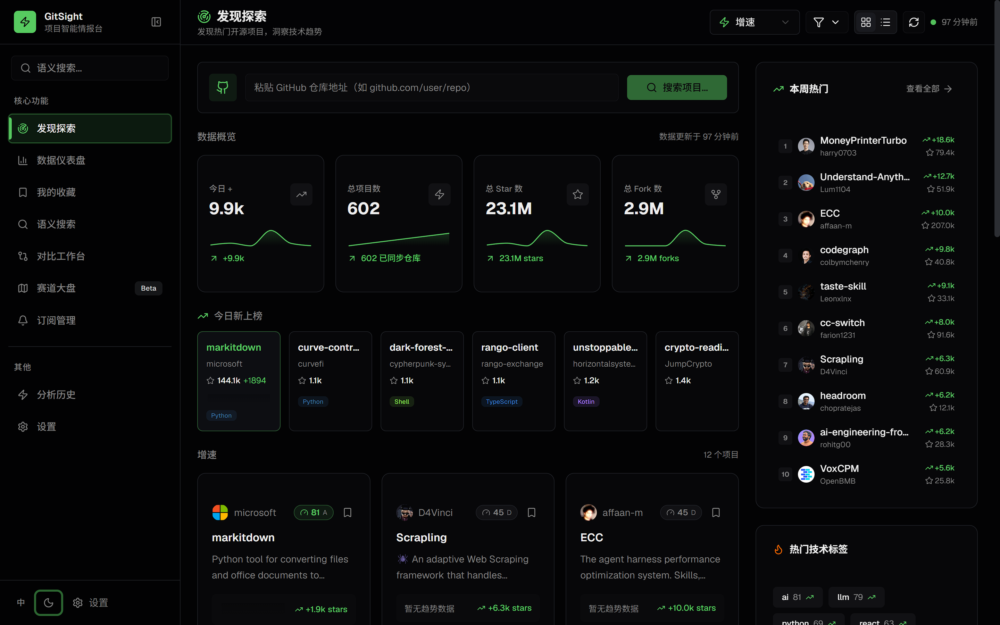
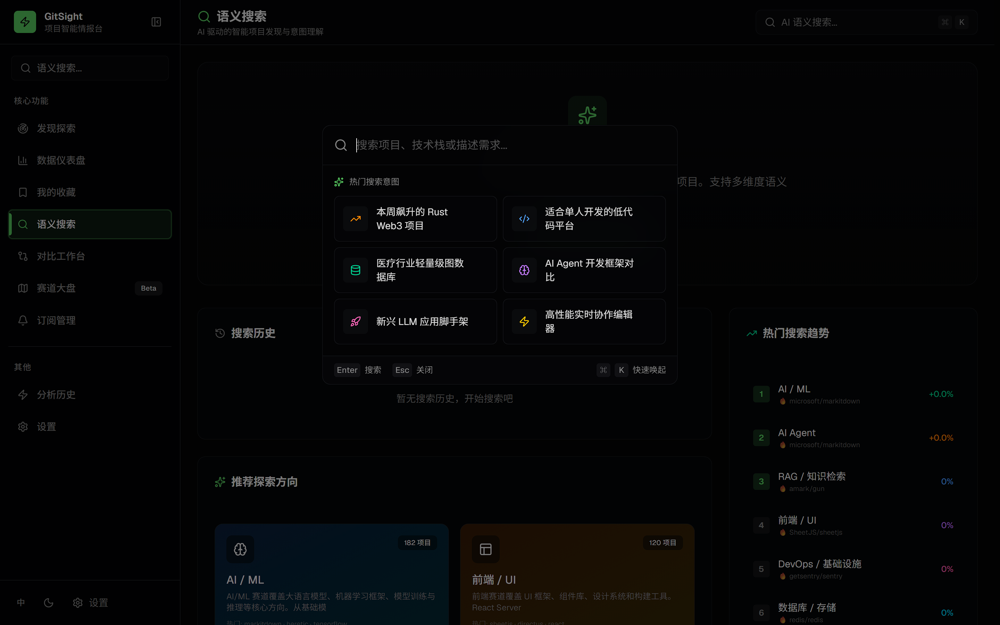
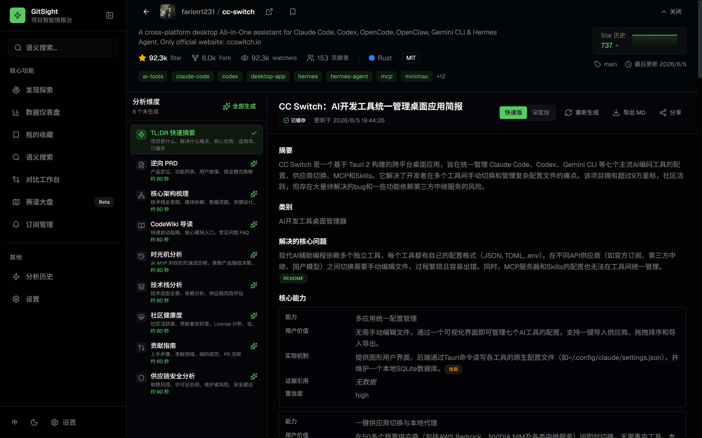
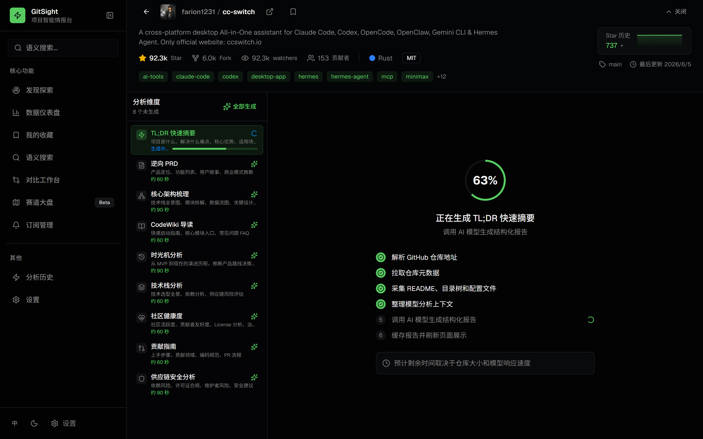
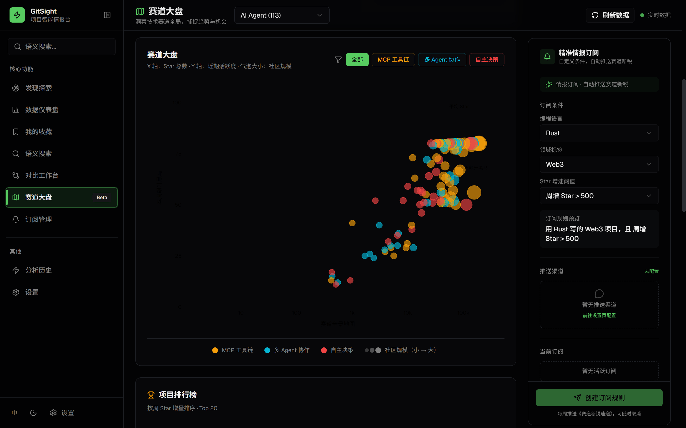
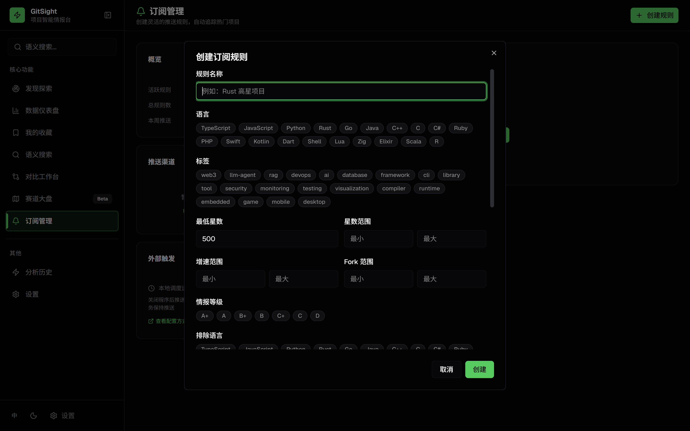

<div align="center">

# GitSight

**Open Source GitHub Project Intelligence Analysis Desktop Tool**

AI-powered deep analysis tool for GitHub open source projects — discover trending projects, analyze technical architecture, gain industry insights, and assist in technology selection decisions

[](https://nextjs.org/)
[](https://react.dev/)
[](https://www.typescriptlang.org/)
[](https://www.electronjs.org/)
[](./LICENSE)

[中文](README.md) | English

</div>

---

## Why GitSight?

Facing millions of open source projects on GitHub, have you ever encountered these problems:

- **Difficult technology selection**: Star count doesn't tell the whole story. How do you assess a project's real maturity and risks?
- **Fragmented information**: README, Issues, PRs, and Releases are scattered everywhere, making it hard to form a quick judgment
- **Lack of comparison perspective**: What are the pros and cons of similar projects? How to choose the most suitable one?
- **High tracking costs**: Technology domains you're following are constantly evolving, and manual tracking is inefficient

GitSight transforms raw GitHub data into **traceable, verifiable, and actionable** deep analysis reports to help you make smarter open source technology decisions.

---

## Download & Install

### Desktop (Recommended)

Go to the [Releases](https://github.com/LuckyOneTwoThree/gitsight/releases) page to download the latest version:

| Platform | File | Notes |
|----------|------|-------|
| Windows | `GitSight-x.x.x-Setup.exe` | Installer, double-click to install |
| macOS | `GitSight-x.x.x-arm64.dmg` / `GitSight-x.x.x-x64.dmg` | Supports Intel and Apple Silicon |
| Linux | `GitSight-x.x.x.AppImage` | Add execution permission after download |

> Desktop version requires [Node.js >= 22](https://nodejs.org/) to be installed (for running the built-in analysis service).

### Web Version

If you prefer to deploy the web version yourself, please refer to the [Local Development](#local-development) section below.

---

## Quick Start

### 1. Launch the App

Open GitSight after installation. It will automatically sync GitHub Trending data on first launch.

### 2. Configure GitHub Token

Go to the **Settings** page and enter your GitHub Personal Access Token:

- [Create Token](https://github.com/settings/tokens) (default permissions are sufficient)
- You can use it without a token, but GitHub API requests will be rate-limited (60 requests/hour)
- After configuration, the rate limit increases to 5000 requests/hour, and advanced features like Topic discovery are supported

### 3. Configure LLM API Key

Go to the **Settings** page, select an LLM provider, and enter your API Key (required for generating analysis reports):

| Provider | Default Model | Notes |
|----------|---------------|-------|
| OpenAI | `gpt-4.1-mini` | GPT-4.1 / GPT-4o series |
| Anthropic (Claude) | `claude-sonnet-4-20250514` | Claude Sonnet / Haiku series |
| Google (Gemini) | `gemini-2.5-flash` | Gemini 2.5 / 2.0 series |
| DeepSeek | `deepseek-chat` | DeepSeek-V3 / R1 |
| Qwen (Alibaba) | `qwen-plus` | Qwen-Plus / Turbo / Max |
| Zhipu (GLM) | `glm-4-flash` | GLM-4 series |
| Kimi (Moonshot) | `moonshot-v1-32k` | Moonshot series |
| MiMo (Xiaomi) | `mimo-v2.5-pro` | MiMo series |
| Doubao (Volcano Engine) | `doubao-1.5-pro-32k` | Doubao series |
| Baichuan | `Baichuan4` | Baichuan series |
| Yi (01.AI) | `yi-lightning` | Yi series |
| StepFun | `step-2-16k` | Step series |
| MiniMax | `MiniMax-Text-01` | MiniMax series |
| SiliconFlow | `Qwen/Qwen3-8B` | Multi-model hosting platform |
| OpenRouter | `google/gemini-2.5-flash-preview` | Multi-model aggregation platform with free quota |
| Custom | — | Supports any OpenAI-compatible API |

> All providers support custom API endpoints and model names in the settings page, making it easy to connect to private deployments or proxy services.

### 4. Start Exploring

- **Discovery**: Browse automatically synced trending projects, click the refresh button in the top right to manually trigger data sync
- **Repository Analysis**: Click any project to enter the details page, select report type and mode (Fast/Deep) to generate an AI analysis report
- **Compare Analysis**: Add multiple projects to compare and generate horizontal comparison reports
- **Semantic Search**: Describe your needs in natural language, and AI will automatically search for matching projects
- **Landscape**: View the ecosystem panorama of 8 major technology tracks

---

## Core Features

### Intel Score Three-Dimensional Rating

An original open source project health assessment system that quantifies project status from three dimensions:

| Dimension | Meaning | Assessment Content |
|-----------|---------|-------------------|
| **Velocity** | Activity | Recent commit frequency, Issue response speed, Release rhythm |
| **Community** | Community Power | Contributor growth, PR merge rate, community diversity |
| **Maturity** | Maturity | Project age, Star trend stability, documentation completeness |

### 8 Types of Deep Analysis Reports

Each report is generated by AI playing a specific expert role, based on an **evidence chain system** to ensure credible analysis:

| Report Type | Role | Output |
|-------------|------|--------|
| **TL;DR** | Senior Product Analyst | 2-minute judgment on whether a project is worth deep research |
| **Reverse PRD** | Chief Product Strategist | Business model inference + opportunity scorecard + action plan |
| **Architecture Analysis** | Chief Software Architect | System architecture + module boundaries + data flow + Mermaid diagrams |
| **Code Wiki** | Senior Developer Advocate | Developer onboarding guide + reading path + extension points |
| **Timeline** | Product Strategy Analyst | Product evolution milestones + strategic transformation points |
| **Tech Stack** | Tech Stack Analyst | Technology selection evaluation + supply chain risks + engineering maturity |
| **Community Health** | Open Source Community Health Analyst | Community health score + maintenance pressure + contributor friendliness |
| **Contribution Guide** | Open Source Maintainer | Complete path from interest to first PR |

### Two Analysis Modes

- **Fast Mode**: Skip evidence extraction, single-pass generation, suitable for quickly understanding project overview
- **Deep Mode**: Three-stage pipeline (evidence extraction → structured generation → quality review), automatic retry mechanism, produces deep reports

### Multi-Repository Comparison Analysis

Select 2-6 projects, and AI automatically generates multi-dimensional horizontal comparison reports with radar chart visualization.

### AI Semantic Search

Describe your needs in natural language (supports Chinese and English), the system automatically parses search intent, performs multi-source parallel searches, and intelligently ranks results.

### Technology Landscape

Ecosystem panorama of 8 major technology tracks (AI/ML, AI Agent, RAG, Frontend/UI, DevOps, Database, Programming Tools, Web3): bubble charts + project rankings + track summaries.

### Intelligence Subscription

Custom alert rules: filter by language, tags, Star thresholds, and frequency, supporting multi-channel push (Feishu, WeCom, DingTalk, Bark, PushPlus, Qmsg, Discord, Telegram, WxPusher, ServerChan, Custom Webhook).

### Bookmark Management

One-click bookmark interesting projects, view bookmark list anytime, with tag filtering support.

### Light/Dark Theme

Supports light and dark theme switching, Chinese and English bilingual interface, sidebar quick toggle.

---

## Product Showcase

### Discovery

Homepage data overview, real-time display of GitHub Trending hot projects, data dashboard, and weekly hot rankings.



### AI Semantic Search

Describe your needs in natural language, AI automatically parses intent, performs multi-source parallel searches, and intelligently recommends.



### Repository Deep Analysis

8 types of expert-level analysis reports, from TL;DR quick summary to supply chain security analysis, covering all dimensions of a project.



### AI Analysis Generation Process

Deep Mode three-stage pipeline: evidence extraction → structured generation → quality review, with real-time generation progress display.



### Technology Landscape

Ecosystem panorama of 8 major technology tracks, bubble chart visualization + project rankings + track summaries, insight into technology trends.



### Intelligence Subscription Management

Custom push rules, multi-dimensional filtering by language, tags, Star thresholds, growth rate, etc., supporting multi-channel push.



---

## Technical Architecture

### Tech Stack

| Layer | Technology |
|-------|------------|
| Frontend Framework | Next.js 16 + React 19 |
| Desktop | Electron 42 |
| Language | TypeScript 5.7 |
| Styling | TailwindCSS 4 + shadcn/ui |
| Data Storage | SQLite (better-sqlite3) |
| AI Integration | OpenAI-compatible API (5+ providers) |
| Charts | Recharts + Mermaid |
| Internationalization | Lightweight custom i18n (dictionary + Context) |
| Theme | next-themes + CSS variables (oklch color space) |

### Analysis Pipeline

```
GitHub Repository URL
       |
       ▼
┌─────────────────┐
│  Data Collection │  GitHub REST API
│  github-context  │  README / file tree / config files / source / CI / Issues / PR / Releases
└────────┬────────┘
         |
         ▼
┌─────────────────┐
│  Evidence        │  Deep Mode exclusive
│  extraction      │  Confirmed facts / inferred signals / unknowns
│                  │  Each evidence has unique ID + source annotation
└────────┬────────┘
         |
         ▼
┌─────────────────┐
│  Report          │  LLM plays expert role
│  generation      │  Evidence package + raw context → structured JSON
│                  │  Each claim must include evidence_refs + confidence
└────────┬────────┘
         |
         ▼
┌─────────────────┐
│  Quality         │  Dual review
│  assurance       │  Rule-based checks: required fields / evidence refs / anti-hallucination / unknowns
│                  │  LLM review: 82-point commercial standard / hallucination detection / executability
│                  │  Auto-retry once if failed, take higher score version
└─────────────────┘
```

### Project Structure

```
├── app/                          # Next.js pages and API routes
│   ├── api/                      # API routes
│   │   ├── repos/[owner]/[name]/ # Repository data + analysis report API
│   │   ├── compare/              # Comparison analysis API
│   │   ├── search/               # Semantic search API
│   │   ├── landscape/            # Landscape API
│   │   ├── alerts/               # Intelligence subscription API
│   │   ├── watchlist/            # Bookmark management API
│   │   ├── sync/                 # Manual data sync trigger API
│   │   ├── token-usage/          # Token usage statistics API
│   │   ├── backup/               # Data backup/restore API
│   │   ├── desktop/config/       # Desktop configuration API
│   │   └── projects/             # Project discovery API
│   ├── page.tsx                  # Discovery page
│   ├── dashboard/                # Data dashboard
│   ├── landscape/                # Landscape
│   ├── compare/                  # Comparison workspace
│   ├── watchlist/                # Bookmark management
│   ├── search/                   # Search page
│   ├── profile/                  # Analysis history
│   ├── alerts/                   # Intelligence subscription
│   ├── settings/                 # Settings page
│   └── repo/[owner]/[name]/      # Repository analysis detail page
├── components/                   # UI components
│   ├── repo/                     # Repository analysis components
│   ├── search/                   # Search components
│   ├── compare/                  # Comparison components
│   ├── landscape/                # Landscape components
│   ├── dashboard/                # Dashboard components
│   ├── projects/                 # Project card/grid components
│   ├── layout/                   # Layout components (sidebar, header)
│   ├── charts/                   # Chart components
│   └── ui/                       # shadcn/ui base components
├── electron/                     # Electron desktop
│   ├── main.ts                   # Main process: start Next.js standalone server
│   ├── tray.ts                   # System tray
│   ├── preload.ts                # Preload script
│   └── resources/                # App icons
├── src/server/                   # Backend business logic
│   ├── modules/
│   │   ├── analysis/             # Analysis engine (core)
│   │   ├── compare/              # Comparison analysis module
│   │   ├── project/              # GitHub data fetch + Intel Score rating
│   │   ├── search/               # Semantic search module
│   │   ├── landscape/            # Landscape module
│   │   ├── alerts/               # Intelligence subscription + push module
│   │   └── user/                 # Workspace module
│   └── lib/
│       ├── database.ts           # SQLite database
│       ├── llm-provider.ts       # LLM multi-provider adapter
│       ├── desktop-config.ts     # Desktop configuration management
│       └── env.ts                # Environment variable management
├── lib/                          # Frontend utility functions
│   ├── i18n.ts                   # Internationalization dictionary
│   ├── constants.ts              # Constant definitions
│   └── utils.ts                  # Utility functions
├── hooks/                        # React Hooks
└── public/                       # Static assets
```

---

## Local Development

### Requirements

- Node.js >= 20
- npm >= 9

### Web Mode

```bash
# Clone the repository
git clone https://github.com/LuckyOneTwoThree/gitsight.git
cd gitsight

# Install dependencies
npm install

# Start the dev server
npm run dev
```

Visit http://localhost:3000 to use.

### Desktop Development Mode

```bash
# Install dependencies
npm install

# Start desktop development mode (start Next.js dev server first, then Electron)
npm run dev          # Terminal 1: Start Next.js
npm run dev:desktop  # Terminal 2: Start Electron
```

### Desktop Packaging

```bash
# Build and package desktop installer
npm run build:desktop

# Package only (without rebuilding Next.js)
npm run pack:desktop
```

Packaged output is in the `dist-electron-output/` directory.

### Environment Variables

Create a `.env.local` file in the project root:

#### Required Variables

| Variable | Description | Example |
|----------|-------------|---------|
| `GITHUB_TOKEN` | GitHub Personal Access Token | `ghp_xxxxxxxxxxxx` |
| `LLM_PROVIDER` | LLM Provider | `openai` / `deepseek` / `kimi` / `mimo` / `openrouter` |

#### LLM Provider Configuration

Configure the corresponding API Key based on the `LLM_PROVIDER` value (can also be configured visually in the settings page):

| Provider | Required Variable | Default Model |
|----------|-------------------|---------------|
| `openai` | `OPENAI_API_KEY` | `gpt-4.1-mini` |
| `anthropic` | `ANTHROPIC_API_KEY` | `claude-sonnet-4-20250514` |
| `google` | `GOOGLE_API_KEY` | `gemini-2.5-flash` |
| `deepseek` | `DEEPSEEK_API_KEY` | `deepseek-chat` |
| `qwen` | `QWEN_API_KEY` | `qwen-plus` |
| `zhipu` | `ZHIPU_API_KEY` | `glm-4-flash` |
| `kimi` | `KIMI_API_KEY` | `moonshot-v1-32k` |
| `mimo` | `MIMO_API_KEY` | `mimo-v2.5-pro` |
| `volcengine` | `VOLCENGINE_API_KEY` | `doubao-1.5-pro-32k` |
| `openrouter` | `OPENROUTER_API_KEY` | `google/gemini-2.5-flash-preview` |
| `custom` | `LLM_API_KEY` | Custom |

Each provider also supports `*_BASE_URL` and `*_MODEL` variables for custom API endpoints and models.

#### Optional Variables

| Variable | Description |
|----------|-------------|
| `GITHUB_API_BASE_URL` | GitHub API endpoint, default `https://api.github.com` |

---

## Common Commands

```bash
# Development
npm run dev              # Start Web dev server
npm run dev:desktop      # Start desktop development mode

# Build
npm run build            # Next.js production build
npm run build:electron   # Compile Electron main process TypeScript
npm run build:desktop    # Full desktop build + packaging

# Check
npm run lint             # ESLint check
npm run typecheck        # TypeScript type check
```

---

## Push Channel Configuration

GitSight supports the following push channels, configured in the settings page or subscription management:

| Channel | Type | Description |
|---------|------|-------------|
| Feishu | Domestic | Group bot Webhook |
| WeCom | Domestic | Group bot Webhook |
| DingTalk | Domestic | Group bot Webhook |
| Bark | International | iOS push |
| PushPlus | Domestic | WeChat push |
| Qmsg | Domestic | QQ push |
| WxPusher | Domestic | WeChat push |
| ServerChan | Domestic | WeChat push |
| Discord | International | Webhook |
| Telegram | International | Bot API |
| Custom Webhook | Universal | Any HTTP endpoint |

---

## Track Coverage

| Track | Key Areas | Technology Stack |
|-------|-----------|------------------|
| AI/ML | Large model inference, model training, multimodal | PyTorch / Transformers / Diffusion |
| AI Agent | Multi-Agent collaboration, MCP toolchain, autonomous decision-making | LangChain / CrewAI / AutoGen |
| RAG / Knowledge Retrieval | RAG frameworks, vector databases, graph databases | LlamaIndex / Milvus / Neo4j |
| Frontend / UI | UI component libraries, CSS styling, full-stack frameworks | React / Vue / TailwindCSS |
| DevOps / Infrastructure | Container orchestration, observability, IaC | Kubernetes / Terraform / Prometheus |
| Database / Storage | Relational, NoSQL, analytical engines | PostgreSQL / Redis / ClickHouse |
| Programming Tools | AI programming assistants, editors, CLI | Neovim / VS Code / Terminal |
| Web3 / Blockchain | DeFi, on-chain infrastructure, smart contracts | Ethereum / Solana / Solidity |

---

## Data Security

- All data is stored in a local SQLite database
- Sensitive configurations such as API Keys are stored encrypted locally
- No personal data is uploaded to third-party servers
- Supports data backup and restore

---

## Contributing

Issues and Pull Requests are welcome!

1. Fork this repository
2. Create a feature branch: `git checkout -b feature/your-feature`
3. Commit changes: `git commit -m 'Add your feature'`
4. Push branch: `git push origin feature/your-feature`
5. Submit a Pull Request

---

## License

[MIT](./LICENSE)
